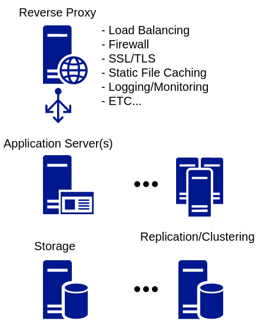

이직한 회사에서 루비 온 레일즈를 처음 쓰게 되어 스터디겸 파일럿 프로젝트를 진행하고 있다.

실제로 사용할 서비스이기 때문에 배포와 운영 단계까지 고려하고 있는데, 프로젝트를 Dockerize하여 [docker-compose](https://docs.docker.com/compose/)로 운영하는 방향으로 정했다.

Dockerfile 이미지를 만들고 docker-compose로 서비스를 정의하는 것은 레일즈 뿐 아니라 대부분의 웹 앱이 비슷한 구성을 따라가기 때문에 이번에 하고 있는 레일즈 서비스 구성 과정을 참고 삼아 남겨두려고 한다.

# 일반적인 웹 애플리케이션 구성

일반적으로(적어도 내가 봐온 것들 기준으로) 작은 규모의 웹 서비스는 위 그림같이 프록시, 앱(+런타임) 서버, 스토리지(File, DB, Cache 등)으로 구성된다.
 
대표적인 예시로, APM(Apach + PHP + MySQL) 또한 이 구성에서 크게 벗어나지 않는다.

다만, APM처럼 하나의 웹서버가 프록시와 앱 실행 역할을 둘 다 수행하고 있다면 두 개의 웹 서버로 분리해주는 것이 서비스 구성성(Composability) 확보에 도움이 된다.

여기서는 NGINX, Ruby on Rails, MariaDB의 단일 인스턴스로만 스택을 구성한다. 서비스 이름을 줄여서 각각 Web, App, DB 라고 별칭한다.

# App 이미지 만들기

## Dockerfile 이미지

## ENTRYPOINT 스크립트

# docker-compose로 서비스 스택 정의하기

## App 서비스

## DB 서비스

## Web 서비스

## 서비스 확장

# 마무리하며

서비스가 SaaS급 정도되면 Dockerize하고 관리하는 데 한 개 팀 정도는 있어야겠지만, 단일 호스트에서 실행되고 관리되는 작은 In-house 서비스는 docker-compose 정도로도 충분하다.

그리고 서비스 스택을 Dockerize하는 과정은 서비스 운영을 **최소한의 구성**으로 **자동화**하는 과정에 가깝기 때문에 애플리케이션이 요구하는 숨은 의존성과 운영에 필요한 공수를 미리 파악하는데 도움이 된다.

일단 지금 당장은 별 쓸모 없는 야크쉐이빙이지만, 해놓으면 나중에 삽질할 일 조금이라도 줄겠지
